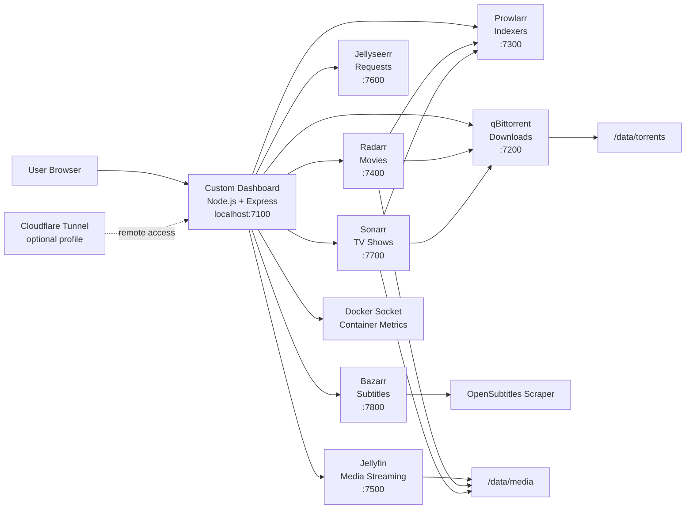
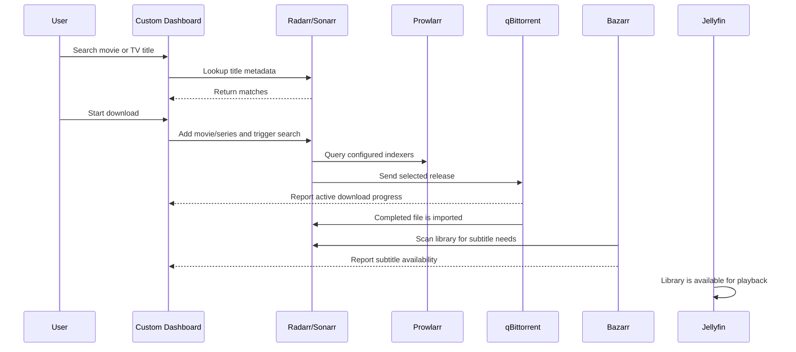
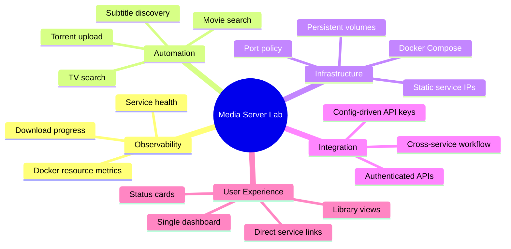

# Media Server Lab

> A containerized, full-stack home media automation platform with a custom dashboard, service health monitoring, download orchestration, subtitle automation, and optional remote access.


## Overview

Media Server Lab is a self-hosted media stack built to demonstrate practical infrastructure, backend integration, API orchestration, and user-facing dashboard development. It brings together several production-style services behind a single Docker Compose environment and adds a custom Node.js/Express control plane that makes the stack easier to monitor and operate.

This project is not just a collection of containers. The custom dashboard service acts as an integration layer across Jellyfin, Jellyseerr, Radarr, Sonarr, Prowlarr, qBittorrent, Bazarr, Docker, and Cloudflare Tunnel. It reads service configuration, authenticates with internal APIs, aggregates health and resource data, exposes library and download controls, and serves a responsive frontend for day-to-day operation.

## Why This Project Matters

This repo highlights the kind of engineering work that matters in real systems:

| Area | What This Project Shows |
| --- | --- |
| Full-stack development | A custom Express backend and responsive frontend dashboard |
| Infrastructure | Multi-service Docker Compose architecture with persistent config and data volumes |
| API integration | Authenticated calls into Radarr, Sonarr, Prowlarr, Jellyseerr, qBittorrent, and Bazarr |
| Operations | Health checks, resource monitoring, restart-safe containers, clear port policy |
| Automation | Search-to-download flows for movies and TV shows plus subtitle discovery |
| Security awareness | `.env`-based tunnel token handling and ignored local runtime data |
| Product thinking | One dashboard that reduces operational friction across many specialized tools |

## Architecture



## Request-To-Watch Flow



## Service Map

| Service | Role | Host Port |
| --- | --- | ---: |
| Custom dashboard | Main UI, API gateway, health aggregation, controls | `7100` |
| qBittorrent | Download client | `7200` |
| Prowlarr | Indexer management | `7300` |
| Radarr | Movie automation | `7400` |
| Jellyfin | Media streaming server | `7500` |
| Jellyseerr | Media request management | `7600` |
| Sonarr | TV automation | `7700` |
| Bazarr | Subtitle management | `7800` |
| Cloudflared | Optional remote tunnel | profile: `remote-access` |

The stack intentionally keeps host ports in the `7000` range to make the environment predictable and easy to operate.

## Features

### Custom Dashboard

- Single entry point at `http://localhost:7100`
- Service status cards for the whole stack
- Docker resource metrics through the Docker socket
- Movie and TV library views
- Active download monitoring
- Search and download actions for movies and shows
- Manual torrent upload support
- Subtitle availability indicators
- Direct links to each underlying service

### Zero-Touch Deployment & Auto-Configuration

A custom `auto-configurator` Python container orchestrates the setup of the entire stack from scratch:
- Automatically injects predefined API keys into Radarr, Sonarr, Prowlarr, Bazarr, Jellyfin, and Jellyseerr using `init-scripts/` and direct API calls.
- Configures media size limits (e.g. 10GB for movies, 2GB for shows).
- Directly connects Radarr and Sonarr to qBittorrent, Prowlarr, and Bazarr.
- Seeds Jellyseerr to bypass the initial setup wizard.
- Sets up instant Webhook notifications so Jellyfin immediately scans new downloads.
- Adds top public indexers directly into Prowlarr.
- Ensures Radarr and Sonarr prioritize "Original Language" audio profiles.

### Backend Integration Layer

The Express backend in [`backend/server.js`](backend/server.js) provides API endpoints that normalize multiple services into one dashboard-friendly API:

| Endpoint | Purpose |
| --- | --- |
| `GET /api/system` | Stack mode, paths, and service summary |
| `GET /api/services` | Health and details for each service |
| `GET /api/services/resources` | Docker CPU, memory, and network usage |
| `GET /api/downloads` | Active qBittorrent downloads |
| `DELETE /api/downloads` | Remove all active downloads and files |
| `GET /api/requests` | Recent Jellyseerr requests |
| `GET /api/library/movies` | Radarr movie library with subtitle context |
| `GET /api/library/tv` | Sonarr TV library with subtitle context |
| `GET /api/search?q=...` | Cross-service movie/TV lookup |
| `POST /api/download` | Add movie or show and trigger search |
| `POST /api/upload-torrent` | Upload a torrent file to qBittorrent |
| `GET /stream/:folder/:file` | Range-aware local video streaming |

## Repository Structure

```text
.
|-- backend/
|   |-- Dockerfile
|   |-- package.json
|   `-- server.js
|-- frontend/
|   `-- index.html
|-- config/
|   `-- service configuration directories
|-- data/
|   |-- media/
|   `-- torrents/
|-- docker-compose.yml
|-- .env.example
|-- auto-configurator/
|   |-- Dockerfile
|   `-- setup.py
|-- init-scripts/
|   |-- bazarr-init.sh
|   |-- prowlarr-init.sh
|   |-- radarr-init.sh
|   `-- sonarr-init.sh
`-- README.md
```

## Tech Stack

| Layer | Technologies |
| --- | --- |
| Runtime | Docker, Docker Compose |
| Backend | Node.js, Express, Multer |
| Frontend | HTML, CSS, JavaScript |
| Media | Jellyfin |
| Automation | Radarr, Sonarr, Prowlarr, Jellyseerr |
| Configuration | Python `requests`, SQLite, shell scripts |
| Downloads | qBittorrent |
| Subtitles | Bazarr, OpenSubtitles scraper |
| Remote access | Cloudflare Tunnel profile |

## Getting Started

### Prerequisites

- Docker Desktop or Docker Engine
- Docker Compose
- Enough local disk space for media and downloads
- Optional: a Cloudflare Tunnel token for remote access

### 1. Clone the repository

```bash
git clone https://github.com/vamshi1207/media_server_lab.git
cd media_server_lab
```

### 2. Create environment file

```bash
cp .env.example .env
# Edit .env to add your own API keys and tokens
```

### 3. Start the stack

```bash
docker compose up -d --build
```

Open the dashboard:

```text
http://localhost:7100
```

### 4. Optional remote access

Start the Cloudflare Tunnel profile:

```bash
docker compose --profile remote-access up -d
```

## Troubleshooting

If you encounter issues with Cloudflare tunnel connections (e.g. 502 Bad Gateway), subnet clashes, or stale `/etc/hosts` entries, please see the [Troubleshooting Guide](TROUBLESHOOTING.md) for quick fixes.

## Operational Highlights



## What I Built

- Designed a local media platform using Docker Compose and a clearly documented service boundary model.
- Built a custom Node.js dashboard service that integrates with multiple third-party APIs.
- Implemented service health aggregation with graceful offline/error reporting.
- Added Docker container resource reporting through the Docker socket.
- Created library and download management endpoints for movies, TV shows, and torrents.
- Added support for subtitle availability checks across movie and TV folders.
- Built a browser-based dashboard UI that turns several admin panels into one unified control surface.
- Organized environment variables, ignored runtime artifacts, and separated persistent config/data from source code.

## Security and Privacy Notes

- Do not commit `.env` files, API keys, tunnel tokens, media files, or runtime database files.
- This project is intended for private/self-hosted use.
- If exposing the dashboard remotely, place it behind strong access controls such as Cloudflare Access, a VPN, or another authentication layer.
- Review service credentials before publishing forks or screenshots.

## Future Improvements

- Add authentication to the custom dashboard.
- Add automated tests for backend API adapters.
- Add a GitHub Actions workflow for linting and container build checks.
- Add a screenshot gallery or demo GIF.
- Replace local service secrets with a formal secret-management approach.
- Add structured logging and persistent event history.

## Project Status

This is an active personal infrastructure project focused on practical systems integration, automation, and full-stack dashboard development. It demonstrates how I approach real-world engineering problems: breaking down a workflow, connecting independent services, building useful tooling around them, and documenting the system so another engineer can understand and run it.
